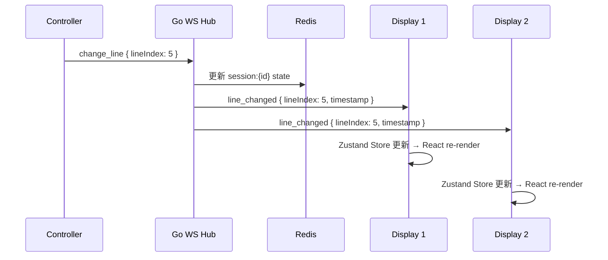

# 系統架構

## 架構概覽

LY 歌詞顯示系統採用**前後端分離架構**：Next.js 作為純前端，Go 作為後端處理所有 API 與 WebSocket。

```
┌─────────────────────────────────────────────────────────────┐
│                        Client Layer                         │
│  ┌──────────────┐  ┌──────────────┐  ┌──────────────┐      │
│  │   Desktop    │  │   Tablet     │  │   Mobile     │      │
│  │   Browser    │  │   Browser    │  │   Browser    │      │
│  └──────┬───────┘  └──────┬───────┘  └──────┬───────┘      │
└─────────┼─────────────────┼─────────────────┼───────────────┘
          │                 │                 │
          ▼                 ▼                 ▼
┌─────────────────────────────────────────────────────────────┐
│                   Next.js 前端 (:3000)                      │
│  ┌─────────────┐  ┌──────────────┐  ┌──────────────┐       │
│  │ Controller  │  │   Display    │  │   Home Page  │       │
│  │   Page      │  │   Page       │  │              │       │
│  └──────┬──────┘  └──────┬───────┘  └──────────────┘       │
│         │                │                                  │
│  ┌──────┴────────────────┴─────────┐                        │
│  │  Zustand Store + WS Client      │                        │
│  └──────┬──────────────────┬───────┘                        │
└─────────┼──────────────────┼────────────────────────────────┘
          │ /api/* (proxy)   │ /ws (直連)
          ▼                  ▼
┌─────────────────────────────────────────────────────────────┐
│                    Go 後端 (:8080)                           │
│  ┌─────────────────────────────────────────────────────┐    │
│  │  chi Router + Middleware (CORS, Logging, Auth)       │    │
│  ├─────────────┬──────────────┬──────────────┐         │    │
│  │  REST API   │  WebSocket   │  Health      │         │    │
│  │  Handlers   │  Hub         │  Check       │         │    │
│  ├─────────────┴──────────────┴──────────────┤         │    │
│  │              Service Layer                 │         │    │
│  │  (Song, Playlist, Settings, User, LRC)    │         │    │
│  ├────────────────────────────────────────────┤         │    │
│  │              Ent ORM + pgx                 │         │    │
│  └────────────────────────────────────────────┘         │    │
└──────────┬──────────────────────┬───────────────────────┘
           │                      │
           ▼                      ▼
┌─────────────────┐      ┌─────────────────┐
│   PostgreSQL    │      │     Redis       │
│   (資料持久化)  │      │  (WS Session)   │
└─────────────────┘      └─────────────────┘
```

---

## 技術棧

### 前端

| 技術 | 版本 | 用途 |
|------|------|------|
| Next.js | 15 | React 框架（純前端模式，API 透過 rewrites 代理） |
| React | 19 | UI 框架 |
| TypeScript | 5.7 | 型別安全 |
| Tailwind CSS | 3.4.19 | 樣式系統 |
| Zustand | 5.0.11 | 全域狀態管理（含 persist） |
| Zod | 4.3 | 請求/回應驗證 |
| react-resizable-panels | 4.7.2 | Controller 面板拖曳調整 |

### 後端（Go）

| 技術 | 版本 | 用途 |
|------|------|------|
| Go | 1.26 | 伺服器語言 |
| entgo.io/ent | 0.14.5 | 型別安全 ORM + 程式碼產生 |
| go-chi/chi/v5 | 5.2.5 | HTTP 路由器 + middleware |
| go-chi/cors | 1.2.2 | CORS 處理 |
| jackc/pgx/v5 | 5.8.0 | PostgreSQL 驅動（連線池） |
| redis/go-redis/v9 | 9.18.0 | Redis 客戶端 |
| coder/websocket | 1.8.14 | 原生 WebSocket |
| golang-jwt/jwt/v5 | 5.3.1 | JWT 生成/驗證 |
| golang.org/x/crypto | — | bcrypt 密碼雜湊 |
| caarlos0/env/v11 | 11.4.0 | 環境變數解析 |
| go-playground/validator/v10 | — | 請求驗證 |

### 基礎設施

| 技術 | 用途 |
|------|------|
| Railway | 雲端部署（Go 後端 + Next.js 前端 + PostgreSQL + Redis） |
| Docker | 多階段建置 |

---

## 前端組件架構

### 頁面結構

```
app/
├── page.tsx                    # 首頁（導航到 Controller/Display）
├── layout.tsx                  # 根佈局（字體：Orbitron, Exo 2, JetBrains Mono）
├── globals.css                 # 全域樣式 + Dark Tech 主題
├── controller/
│   ├── page.tsx                # Broadcast Console 控制台（可拖曳面板）
│   └── layout.tsx              # Controller 佈局
└── display/
    ├── page.tsx                # 全螢幕歌詞顯示
    └── layout.tsx              # Display 佈局
```

### 元件結構

```
components/
├── controller/
│   └── AddSongModal.tsx        # 新增歌曲對話框
├── lyrics/
│   ├── LyricsDisplay.tsx       # 主顯示元件（可見行計算 + 自動滾動）
│   ├── LyricsLine.tsx          # 單行歌詞（霓虹光效 + scale 動畫）
│   ├── LyricsControl.tsx       # 播放控制按鈕
│   └── SongSelector.tsx        # 歌曲選擇器
├── settings/
│   └── SettingsPanel.tsx       # 顯示設定面板
├── ui/
│   └── Toast.tsx               # Toast 通知
└── StoreHydration.tsx          # Zustand hydration
```

### 前端核心函式庫

```
lib/
├── api/songs.ts                # Song API 封裝（fetch → Go 後端 via rewrites）
├── auth/session.ts             # JWT 管理（cookie: access_token）
├── websocket/
│   ├── native-client.ts        # 原生 WebSocket Client（265 行）
│   └── types.ts                # WS 事件型別
├── store/index.ts              # Zustand Store（LyricsState + LyricsActions）
├── schemas/index.ts            # Zod 驗證 schema
├── lrc/parser.ts               # LRC 前端解析器
└── errors/AppError.ts          # AppError 型別定義
```

---

## 後端架構（Go 三層架構）

```
backend/internal/
├── handler/                    # HTTP 層 — 接收 HTTP 請求、回傳 JSON
│   ├── auth.go                 # 認證端點
│   ├── song.go                 # 歌曲 CRUD
│   ├── lrc.go                  # LRC 匯入/匯出
│   ├── playlist.go             # 播放列表
│   ├── settings.go             # 使用者設定
│   ├── health.go               # 健康檢查
│   ├── ws.go                   # WebSocket upgrade
│   └── helpers.go              # JSON 回應輔助
│
├── service/                    # 業務邏輯層 — 核心邏輯、資料轉換
│   ├── user.go                 # 使用者管理 + Demo User
│   ├── song.go                 # 歌曲邏輯（JSON 陣列處理、ILIKE 搜尋）
│   ├── playlist.go             # 播放列表邏輯
│   ├── settings.go             # 設定管理（自動建立預設值）
│   └── lrc.go                  # LRC 解析/序列化（時間戳、元資料）
│
├── ent/schema/                 # 資料層 — Ent ORM Schema
│   ├── user.go                 # 使用者表
│   ├── song.go                 # 歌曲表
│   ├── settings.go             # 設定表
│   ├── playlist.go             # 播放列表表
│   ├── playlistsong.go         # 播放列表歌曲關聯
│   └── session.go              # Session 表
│
├── auth/                       # 認證模組
│   ├── jwt.go                  # JWT 產生/驗證（HS256, access 24h, refresh 30d）
│   ├── password.go             # bcrypt（cost=10, 8-72 bytes）
│   └── middleware.go           # RequireAuth / OptionalAuth
│
├── ws/                         # WebSocket 模組
│   ├── hub.go                  # 中央 Hub（session 分組、channel 事件迴圈）
│   ├── client.go               # 單一連線（ReadPump/WritePump, 30s ping, 32KB 限制）
│   ├── events.go               # 8 個 C2S 事件處理
│   └── protocol.go             # JSON 訊息信封格式
│
├── redis/                      # Redis 模組
│   ├── client.go               # 連線管理
│   └── session.go              # Session 持久化（1hr TTL）
│
├── dto/                        # 資料傳輸物件
│   ├── auth.go                 # Login/Register/Auth DTO
│   ├── song.go                 # Song CRUD DTO
│   ├── playlist.go             # Playlist DTO
│   ├── settings.go             # Settings DTO（含嵌套 DisplaySettings）
│   └── error.go                # 錯誤回應 DTO
│
├── middleware/
│   └── ratelimit.go            # 速率限制（auth: 10 req/min）
│
└── config/
    └── config.go               # 環境變數載入（12-factor app）
```

---

## 資料流

### 1. API 請求流程

```
Browser → Next.js (:3000) → rewrites /api/* → Go Backend (:8080)
                                                    │
                                              chi Router
                                                    │
                                              Middleware
                                         (CORS, Auth, Logging)
                                                    │
                                              Handler
                                                    │
                                              Service
                                                    │
                                              Ent ORM
                                                    │
                                              PostgreSQL
```

### 2. 歌詞同步流程（WebSocket）



### 3. 狀態管理（Zustand Store）

```
Zustand Store (lib/store/index.ts)
├── State
│   ├── lyrics: string[]
│   ├── currentIndex: number
│   ├── currentSong: Song | null
│   ├── displaySettings: DisplaySettings
│   ├── isPlaying: boolean
│   ├── connectionStatus: string
│   └── sessionId: string | null
│
├── Actions
│   ├── setCurrentSong(song)          # 設定歌曲 → WS broadcast
│   ├── nextLine() / prevLine()       # 換行 → WS broadcast
│   ├── jumpToLine(index)             # 跳行 → WS broadcast
│   ├── updateDisplaySettings(s)      # 更新設定 → WS broadcast
│   ├── connect() / disconnect()      # WS 連線管理
│   └── joinSession(id, role)         # 加入 session
│
└── Persist (localStorage)
    └── displaySettings
```

### 4. Session 生命週期

```
1. Controller 開啟 → 連線 WebSocket → join_session(id, "controller")
2. Display 開啟 → 連線 WebSocket → join_session(id, "display")
3. Controller 操作 → Hub 廣播到同 session 所有 client
4. 斷線 → 自動重連（指數退避: 1s, 1.5s, 2.25s, max 5 次）
5. 重連成功 → 自動重新加入先前 session
6. 所有 client 離線 → Redis session 1hr 後過期清除
```

---

## 安全設計

### 認證流程

```
POST /api/auth/login → bcrypt 驗證 → access_token (24h) + refresh_token (30d)
POST /api/auth/refresh → 驗證 refresh_token → 新 access_token

API 請求 → Authorization: Bearer {access_token}
         → RequireAuth middleware 驗證 JWT
         → 或 OptionalAuth（無 token → Demo User ID: 00000000-...0001）
```

### WebSocket 安全

- CORS 白名單（production: `lys.pxdim.com`, `*.up.railway.app`）
- 訊息大小限制：32KB
- 心跳：30 秒 ping/pong
- Session 隔離（不同 session 間訊息不互通）

---

## 技術決策記錄 (ADR)

| ID | 決策 | 理由 | 狀態 |
|----|------|------|------|
| ADR-001 | Next.js 作為前端 | React 生態系成熟、SSR/SSG 支援 | ✅ 採用 |
| ADR-002 | ~~Supabase~~ → 自架 PostgreSQL | 需要更多控制權、避免供應商鎖定 | ✅ 已遷移 |
| ADR-003 | ~~Node.js API~~ → Go + Ent ORM | 更好的效能、型別安全、部署體驗 | ✅ 已遷移 |
| ADR-004 | ~~Socket.IO~~ → 原生 WebSocket (Go) | Go 生態系原生 WS 更成熟 | ✅ 已遷移 |
| ADR-005 | Zustand 狀態管理 | 輕量、無 boilerplate、selector 效能好 | ✅ 採用 |
| ADR-006 | chi HTTP Router | 成熟 middleware 生態系、RESTful 清晰 | ✅ 採用 |
| ADR-007 | Railway 部署 | 內建 PostgreSQL/Redis、Docker 支援 | ✅ 採用 |

---

## 相關文檔

- [API 文檔](api.md)
- [資料庫設計](database.md)
- [部署文檔](../deployment.md)

---

**文件版本:** 2.0
**最後更新:** 2026-03-13

**變更記錄:**
- v2.0 (2026-03-13): 全面改寫 — 反映 Go 後端 + Ent ORM 架構，移除 Supabase/Socket.IO/tRPC 引用
- v1.2 (2026-03-12): 更新 Store 路徑；新增前端組件架構區塊
- v1.0 (2026-03-11): 初始版本
