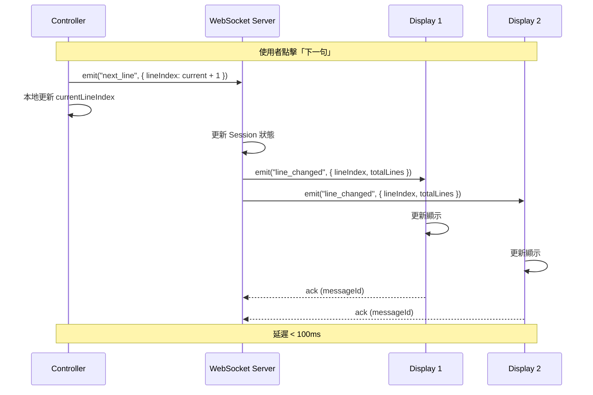
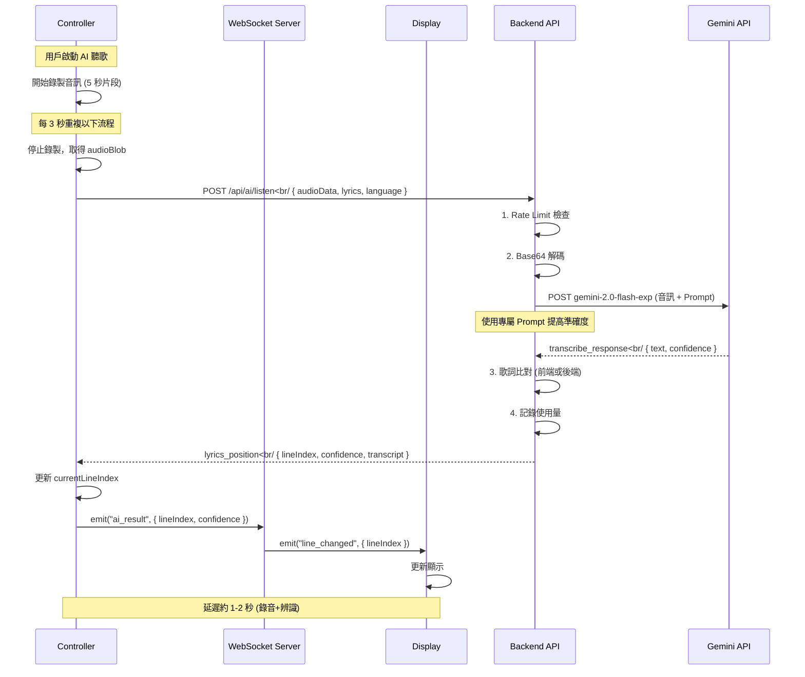
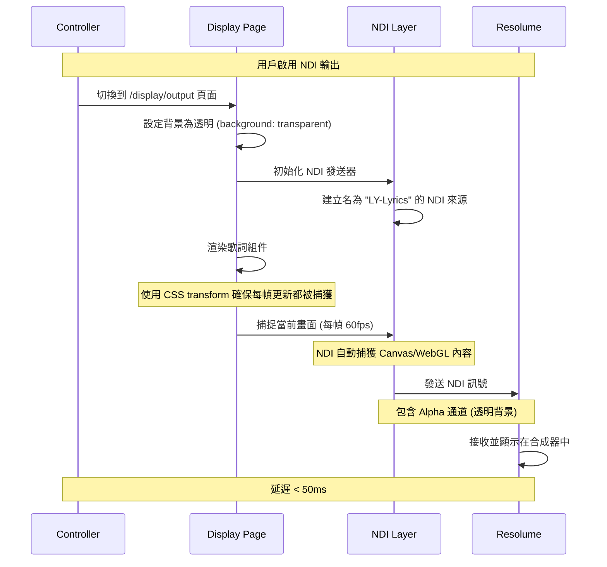
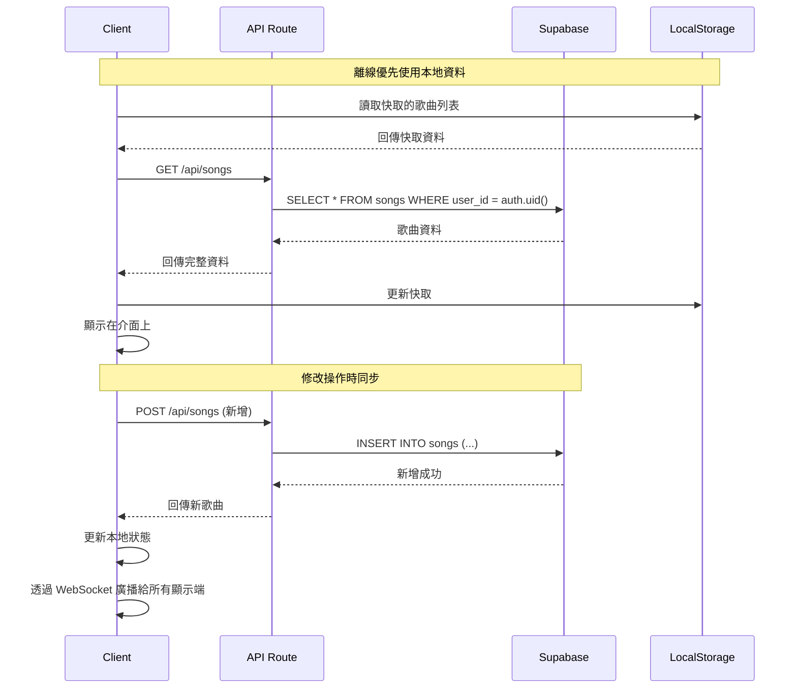

# 系統架構

## 架構概覽

LY 歌詞顯示系統採用 **Serverless + Real-time** 架構，使用 Next.js 15 作為全端框架。

```
┌─────────────────────────────────────────────────────────────┐
│                        Client Layer                         │
│  ┌──────────────┐  ┌──────────────┐  ┌──────────────┐    │
│  │   Desktop    │  │   Tablet     │  │   Mobile     │    │
│  │   Browser    │  │   Browser    │  │   Browser    │    │
│  └──────┬───────┘  └──────┬───────┘  └──────┬───────┘    │
│         │                 │                 │             │
└─────────┼─────────────────┼─────────────────┼─────────────┘
          │                 │                 │
          ▼                 ▼                 ▼
┌─────────────────────────────────────────────────────────────┐
│                   WebSocket Layer                           │
│              (Socket.io / Native WS)                        │
│  ┌─────────────────────────────────────────────────────┐   │
│  │         Real-time Sync ( latency < 100ms )          │   │
│  └─────────────────────────────────────────────────────┘   │
└─────────────────────────────────────────────────────────────┘
                              │
                              ▼
┌─────────────────────────────────────────────────────────────┐
│                    Application Layer                        │
│  ┌─────────────────────────────────────────────────────┐   │
│  │              Next.js 15 App Router                  │   │
│  │  ┌─────────────┐  ┌─────────────┐  ┌─────────────┐ │   │
│  │  │   React     │  │  API Routes │  │  WebSocket  │ │   │
│  │  │  Components │  │  (REST)     │  │   Handler    │ │   │
│  │  └─────────────┘  └─────────────┘  └─────────────┘ │   │
│  └─────────────────────────────────────────────────────┘   │
└─────────────────────────────────────────────────────────────┘
          │                    │                    │
          ▼                    ▼                    ▼
┌─────────────────┐  ┌─────────────────┐  ┌─────────────────┐
│    Supabase     │  │  Google Gemini  │  │   Railway       │
│  (PostgreSQL)   │  │   (AI)          │  │  (Deployment)   │
└─────────────────┘  └─────────────────┘  └─────────────────┘
```

## 技術棧

### 前端

| 技術 | 版本 | 用途 |
|------|------|------|
| Next.js | 15.0.3 | 全端框架 |
| React | 19 | UI 框架 |
| TypeScript | 5.7 | 型別安全 |
| Tailwind CSS | 3.4.19 | 樣式系統 |
| Zustand | 5.0.11 | 狀態管理 |
| Framer Motion | Latest | 動畫效果 |

### 後端

| 技術 | 版本 | 用途 |
|------|------|------|
| Next.js API Routes | 15 | REST API 端點 |
| Socket.IO | 4.8.3 | WebSocket 即時通訊 |
| Zod | Latest | 資料驗證 |

### 資料庫與儲存

| 技術 | 用途 |
|------|------|
| Supabase (PostgreSQL) | 主資料庫 |
| Supabase Auth | 用戶認證 |
| Supabase Storage | 背景圖片/影片 (可選) |

### AI 服務

| 技術 | 用途 |
|------|------|
| Google Gemini API | 音訊辨識、歌詞比對 |

### 部署與基礎設施

| 技術 | 用途 |
|------|------|
| Railway | 應用託管 |
| Cloudflare Workers | 邊緣計算 (可選) |
| Cloudflare CDN | 靜態資源 |

### 第三方整合

| 技術 | 用途 |
|------|------|
| NDI.js | NDI 協議輸出 |
| Spout | Spout 協議輸出 (Windows) |

## 系統組件

### 前端組件架構

```
app/
├── (controller)/              # 控制端路由
│   ├── page.tsx              # 控制面板主頁
│   ├── layout.tsx            # 控制端佈局
│   └── songs/                # 歌曲管理
│       ├── page.tsx          # 歌曲列表
│       └── [id]/page.tsx     # 歌曲編輯
│
├── (display)/                 # 顯示端路由
│   ├── page.tsx              # 顯示端主頁
│   ├── layout.tsx            # 顯示端佈局
│   └── output/               # NDI 輸出頁面
│       └── page.tsx
│
├── api/                       # API 路由
│   ├── songs/                # 歌曲 REST API
│   │   ├── route.ts          # GET/POST 所有歌曲
│   │   └── [id]/route.ts     # GET/PUT/DELETE 單首歌曲
│   ├── playlists/            # 播放列表 REST API
│   ├── settings/             # 設定 REST API
│   ├── ws/                   # WebSocket 資訊 API
│   └── ai/                   # AI 相關 API
│       └── listen/route.ts
│
└── layout.tsx                 # 根佈局
```

### 後端服務架構

```
lib/
├── db/                        # 資料庫
│   ├── supabase/             # Supabase 客戶端
│   │   ├── client.ts         # Browser 客戶端
│   │   └── server.ts         # Service Role 客戶端
│   └── services/             # 業務邏輯層
│       ├── songService.ts    # 歌曲 CRUD 服務
│       ├── playlistService.ts
│       └── settingsService.ts
│
├── websocket/                 # WebSocket
│   ├── server.ts             # Socket.IO 伺服器
│   ├── events.ts             # 事件定義
│   └── handler.ts            # 事件處理
│
├── ai/                        # AI 服務
│   ├── gemini.ts            # Gemini API 整合
│   ├── audio-processor.ts    # 音訊處理
│   └── lyric-matcher.ts      # 歌詞比對演算法
│
└── ndi/                       # NDI 輸出
    ├── ndi.ts                # NDI.js 整合
    └── spout.ts              # Spout 整合
```

## 資料流

### 1. 完整系統數據流向圖

```
┌─────────────────────────────────────────────────────────────────────┐
│                           用戶層                               │
│  ┌──────────┐  ┌──────────┐  ┌──────────┐  ┌──────────┐   │
│  │  Controller   │  │  Display    │  │  Display  │  │  Display  │   │
│  │  (Desktop)  │  │  (Mobile)   │  │  (Tablet) │  │  (NDI)    │   │
│  └─────┬────┘  └─────┬────┘  └─────┬────┘  └─────┬────┘   │
└────────┼──────────────┼──────────────┼──────────┼─────────┘
         │              │              │          │
         │              │              │          │
         ▼              ▼              ▼          ▼
┌─────────────────────────────────────────────────────────────────────┐
│                       WebSocket Server                            │
│  ┌───────────────────────────────────────────────────────────┐   │
│  │              Session Management                               │   │
│  │  ┌──────────┐  ┌──────────┐  ┌──────────┐              │   │
│  │  │ Session 1 │  │ Session 2 │  │ Session N │              │   │
│  │  │ (控制端)   │  │ (顯示端)   │  │ (顯示端)   │              │   │
│  │  └────┬─────┘  └────┬─────┘  └────┬─────┘              │   │
│  │       │             │             │                        │   │
│  │       └─────────────┴─────────────┘                        │   │
│  │                      │                                      │   │
│  │              ┌──────▼──────┐                                 │   │
│  │              │ State Store │ (Zustand)                      │   │
│  │              └──────┬──────┘                                 │   │
│  └───────────────────────┼──────────────────────────────────────┘   │
└───────────────────────────┼───────────────────────────────────────┘
                            │
        ┌───────────────────┴───────────────┐
        │                                       │
        ▼                                       ▼
┌───────────────────┐              ┌───────────────────┐
│  Supabase Database │              │  Gemini AI        │
│  (Songs, Playlists) │              │  (歌詞辨識)      │
└───────────────────┘              └───────────────────┘
```

### 2. 歌詞同步流程 (WebSocket 即時同步)



### 3. AI 聽歌辨識流程 (完整)



### 4. 狀態管理數據流 (Zustand)

```
┌────────────────────────────────────────────────────────────────┐
│                         Zustand Store                           │
│  ┌──────────────────────────────────────────────────────────┐  │
│  │                     LyricsState                          │  │
│  │  ┌─────────────────────────────────────────────────────┐ │  │
│  │  │ currentSong: Song │ │                          │  │
│  │  │ currentLineIndex: number │                         │  │
│  │  │ displaySettings: DisplaySettings │                   │  │  │
│  │  │ connectionStatus: ConnectionStatus │                │  │
│  │  │ aiListening: AiListeningState │                    │  │  │
│  │  └─────────────────────────────────────────────────────┘ │  │
│  └──────────────────────────────────────────────────────────┘  │
│                                                                 │
│  Actions (Methods):                                                │
│  │  setCurrentSong(song)      → 更新當前歌曲                   │  │
│  │  nextLine()                → 當前行 +1                      │  │
│  │  prevLine()                → 當前行 -1                      │  │
│  │  jumpToLine(index)         → 跳到指定行                    │  │
│  │  updateSettings(settings)  → 更新顯示設定                  │  │
│  │  setConnectionStatus()     → 更新連線狀態                │  │
│  │  toggleAiListening()      → 切換 AI 聽歌                 │  │
│  └──────────────────────────────────────────────────────────┘  │
└────────────────────────────────────────────────────────────────┘
         │                    │                    │
         ▼                    ▼                    ▼
    ┌─────────┐        ┌─────────┐        ┌─────────┐
    │Component│        │Component│        │Component│
    │         │        │         │        │         │
    │ (subscribe)│        │(subscribe)│        │(subscribe)│
    └────┬────┘        └────┬────┘        └────┬────┘
         │                   │                   │
         ▼                   ▼                   ▼
    Re-render on state change
```

### 5. NDI 輸出流程



### 6. 資料庫同步流程



### 7. 錯誤處理數據流

```
┌────────────────────────────────────────────────────────────────┐
│                     錯誤處理層級                                │
│                                                                  │
│  ┌──────────────┐    ┌──────────────┐    ┌──────────────┐      │
│  │  組件層      │    │  業務層     │    │  系統層     │      │
│  │  (Component) │    │  (Service)   │    │  Global      │      │
│  │              │    │              │    │              │      │
│  │  錯誤邊界    │    │  try/catch   │    │  window      │      │
│  │              │    │              │    │              │      │
│  │  Fallback UI  │    │  AppError    │    │  監聽器       │      │
│  └──────────────┘    └──────────────┘    └──────────────┘      │
│                                                                  │
│  數據流：                                                         │
│  1. 組件層錯誤 → 顯示 Fallback UI                             │
│  2. 業務層錯誤 → 轉換為 AppError，發送到監控                      │
│  3. 系統層錯誤 → 記錄到日誌，可能需要通知用戶                   │
│                                                                  │
└────────────────────────────────────────────────────────────────┘
```

### 8. Session 生命週期

```
┌────────────────────────────────────────────────────────────────┐
│                    Session 生命週期                               │
│                                                                  │
│  創建立階段                                                       │
│  │                                                                │
│  ├─ 控制端啟動 → 生成 6 位數 Session ID                            │
│  │  │                                                            │
│  ├─ 顯示端連線 → 加入 Session                                    │
│  │  │                                                            │
│  └─ 建立 WebSocket 連線                                         │
│                                                                  │
│  運作階段                                                         │
│  │                                                                │
│  ├─ 控制端發送 next_line → 廣播到所有顯示端                        │
│  │  │                                                            │
│  ├─ AI 辨識結果 → 更新所有裝置的歌詞位置                           │
│  │  │                                                            │
│  ├─ 設定更新 → 同步到所有顯示端                                   │
│  │  │                                                            │
│  └─ 顯示端加入/離線 → 更新連線計數                                   │
│                                                                  │
│  清理階段                                                         │
│  │                                                                │
│  ├─ 控制端關閉 → 通知所有顯示端                                   │
│  │  │                                                            │
│  ├─ 顯示端離線 → 移除連線列表                                     │
│  │  │                                                            │
│  └─ 所有裝置離線 → 30 分鐘後清除 Session                           │
│                                                                  │
└────────────────────────────────────────────────────────────────┘
```

## 狀態管理

### 全域狀態 (Zustand Store)

```typescript
// stores/lyricsStore.ts
interface LyricsState {
  // 當前歌曲
  currentSong: Song | null

  // 當前歌詞行索引
  currentLineIndex: number

  // 顯示設定
  displaySettings: {
    lineCount: number        // 顯示行數
    fontSize: number        // 字體大小
    theme: 'dark' | 'light' // 主題
  }

  // 播放列表
  playlist: Song[]

  // WebSocket 連線狀態
  connectionStatus: 'connected' | 'disconnected' | 'connecting'

  // 操作
  setCurrentSong: (song: Song) => void
  nextLine: () => void
  prevLine: () => void
  setLineIndex: (index: number) => void
  updateSettings: (settings: Partial<DisplaySettings>) => void
}
```

## 安全考量

### 認證與授權

```
┌─────────────┐
│   Client    │
└──────┬──────┘
       │
       ▼
┌─────────────────┐
│  Supabase Auth  │
│  ┌───────────┐  │
│  │  JWT      │  │
│  │  Token    │  │
│  └───────────┘  │
└────────┬────────┘
         │
         ▼
┌─────────────────┐
│  API Middleware │
│  ┌───────────┐  │
│  │ Validate  │  │
│  │ Token     │  │
│  └───────────┘  │
└─────────────────┘
```

### WebSocket 驗證

```typescript
// WebSocket 連線時驗證 JWT
socket.on('connection', async (socket) => {
  const token = socket.handshake.auth.token
  const user = await verifyToken(token)

  if (!user) {
    socket.disconnect()
    return
  }

  // 加入用戶專屬房間
  socket.join(`user:${user.id}`)
})
```

## 效能優化策略

### 1. 前端優化

| 策略 | 實現 |
|------|------|
| Code Splitting | Next.js 動態匯入 |
| 圖片優化 | Next.js Image + WebP |
| 字體優化 | next/font 自動優化 |
| 緩存策略 | React Query 快取 |

### 2. 後端優化

| 策略 | 實現 |
|------|------|
| 資料庫連線池 | Supabase 自動管理 |
| API 回應快取 | Redis (可選) |
| WebSocket 負載均衡 | Railway 自動擴展 |

### 3. 即時通訊優化

| 策略 | 實現 |
|------|------|
| 訊息壓縮 | JSON 最小化 |
| 心跳檢測 | 30s ping/pong |
| 自動重連 | 指數退避演算法 |

## 部署架構

```
┌─────────────────────────────────────────────────────────────┐
│                      Railway App                            │
│  ┌─────────────────────────────────────────────────────┐   │
│  │              Next.js Application                    │   │
│  │  ┌─────────────┐  ┌─────────────┐  ┌─────────────┐ │   │
│  │  │   Frontend  │  │   API       │  │  WebSocket  │ │   │
│  │  │   Static    │  │  Routes     │  │   Server    │ │   │
│  │  └─────────────┘  └─────────────┘  └─────────────┘ │   │
│  └─────────────────────────────────────────────────────┘   │
└─────────────────────────────────────────────────────────────┘
         │                    │                    │
         ▼                    ▼                    ▼
┌─────────────────┐  ┌─────────────────┐  ┌─────────────────┐
│    Supabase     │  │  Google Gemini  │  │  Cloudflare     │
│   (Database)    │  │     (AI)        │  │     CDN         │
└─────────────────┘  └─────────────────┘  └─────────────────┘
```

## 技術決策記錄 (ADR)

| ID | 決策 | 理由 | 狀態 |
|----|------|------|------|
| ADR-001 | 使用 Next.js 全端框架 | AI 友善、開發效率高 | ✅ 採用 |
| ADR-002 | 使用 Supabase 資料庫 | Railway 內建整合、免費層足夠 | ✅ 採用 |
| ADR-003 | 使用 Google Gemini API | 音訊辨識能力強、價格實惠 | ✅ 採用 |
| ADR-004 | 使用 Socket.IO WebSocket | 低延遲雙向通訊、成熟穩定 | ✅ 採用 |
| ADR-005 | 使用 REST API + Zod | 相容性最佳、易於測試 | ✅ 採用 |

---

## 相關文檔

- [API 文檔](api.md)
- [資料庫設計](database.md)
- [部署文檔](../deployment.md)

---

**文件版本:** 1.1
**最後更新:** 2026-03-12

**變更記錄:**
- v1.1 (2026-03-12): 更新技術棧 - 移除 tRPC，改用 REST API；更新 Tailwind CSS 版本為 3.4.19
- v1.0 (2026-03-11): 初始版本
